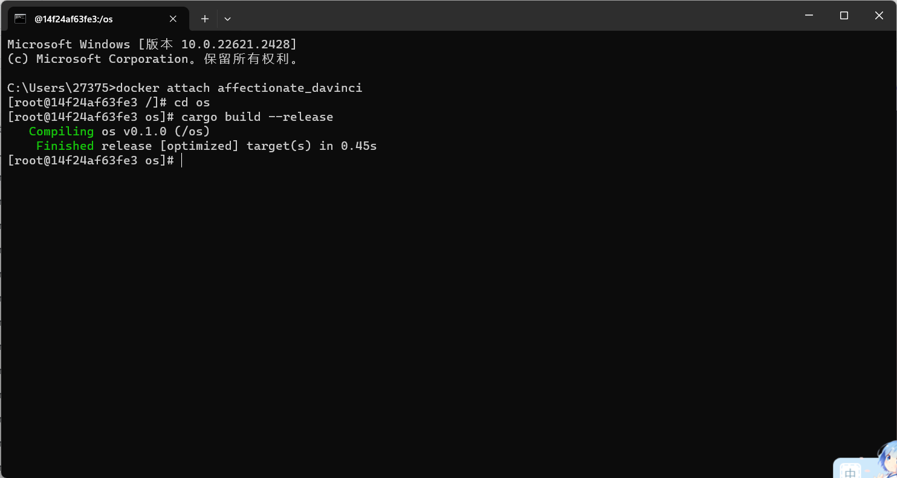
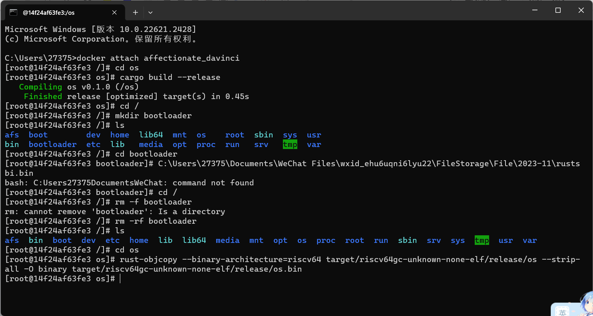
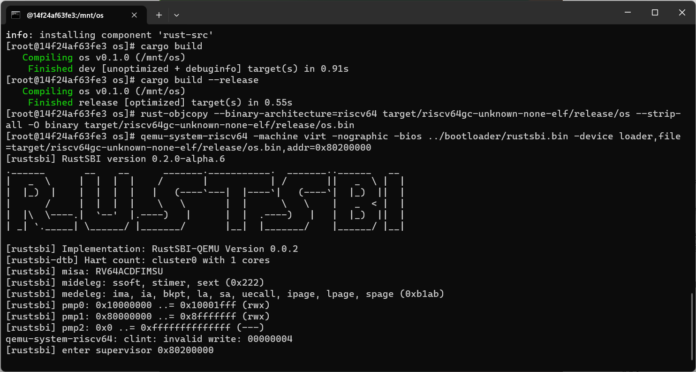
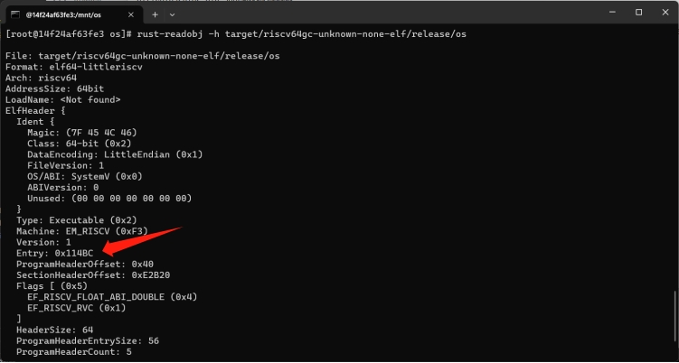
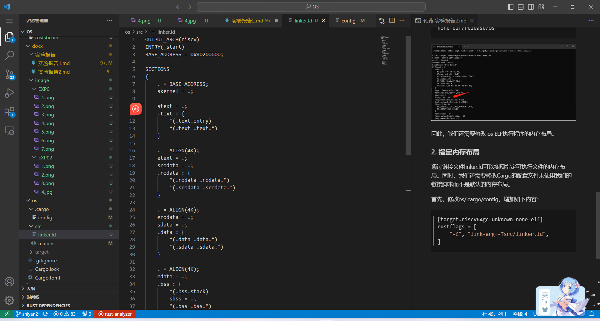

# 2023秋《操作系统》课程实验报告
    实验2    21301156  林家旺

## 一、实验步骤

### 1. 编译生成内核镜像
编译代码 （在/os里面）
```rust
cargo build --release
```


然后，再把编译生成的ELF执行文件转成binary文件：
```shell
rust-objcopy --binary-architecture=riscv64 target/riscv64gc-unknown-none-elf/release/os --strip-all -O binary target/riscv64gc-unknown-none-elf/release/os.bin
```

> 在运行之前，还需要在os目录的同级目录下创建bootloader目录，并将rustsbi.bin放在bootloader目录下。Rustsbi.bin可以通过https://github.com/rustsbi/rustsbi-qemu下载。

> 注意：请使用老师给的rustsbi.bin，因为版本的不同会造成潜在的问题。


接着，加载运行生成的二进制文件。

```shell
qemu-system-riscv64 -machine virt -nographic -bios ../bootloader/rustsbi.bin -device loader,file=target/riscv64gc-unknown-none-elf/release/os.bin,addr=0x80200000
```



这时候运行会进入死循环，原因是操作系统的入口地址不对！对于os ELF执行程序，通过rust-readobj分析，看到的入口地址不是约定的 0x80200000。

>注意：退出qemu可以通过Docker Desktop里的容器的命令行杀死qemu的进程。

具体分析命令如下：
```shell
rust-readobj -h target/riscv64gc-unknown-none-elf/release/os
```




因此，我们还需要修改 os ELF执行程序的内存布局。

### 2. 指定内存布局

通过链接文件linker.ld可以实现指定可执行文件的内存布局。同时，我们还需要修改Cargo的配置文件来使用我们的链接脚本而不是默认的内存布局。

首先，修改os/.cargo/config，增加如下内容：

```vim
[target.riscv64gc-unknown-none-elf]
rustflags = [
    "-C", "link-arg=-Tsrc/linker.ld",
]
```
---
链接脚本文件os/src/linker.ld的内容如下：

```rust
OUTPUT_ARCH(riscv)
ENTRY(_start)
BASE_ADDRESS = 0x80200000;

SECTIONS
{
    . = BASE_ADDRESS;
    skernel = .;

    stext = .;
    .text : {
        *(.text.entry)
        *(.text .text.*)
    }

    . = ALIGN(4K);
    etext = .;
    srodata = .;
    .rodata : {
        *(.rodata .rodata.*)
        *(.srodata .srodata.*)
    }

    . = ALIGN(4K);
    erodata = .;
    sdata = .;
    .data : {
        *(.data .data.*)
        *(.sdata .sdata.*)
    }

    . = ALIGN(4K);
    edata = .;
    .bss : {
        *(.bss.stack)
        sbss = .;
        *(.bss .bss.*)
        *(.sbss .sbss.*)
    }

    . = ALIGN(4K);
    ebss = .;
    ekernel = .;

    /DISCARD/ : {
        *(.eh_frame)
    }
}
```

