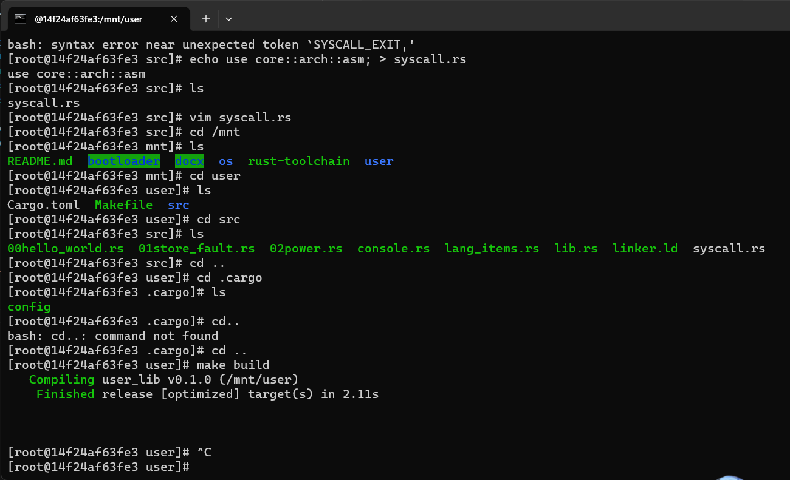

# 2023秋《操作系统》课程实验报告
    实验2    21301156  林家旺

## 一、实验步骤

### 1. 设计和实现应用程序

实现一个简单的批处理操作系统，需要先实现应用程序，要求应用程序在用户态下运行。应用程序及其对应的库文件放置在工作目录下的user目录下。这部分的实现与上一节裸机环境和最小化内核部分有很多相同的实现。

注意，通过如下命令创建user目录：
```shell
cargo new user_lib
mv user_lib user
rm user/src/main.rs
```
>此处运行rm语句后要再打一个y表示确认
---

#### （1）首先实现应用程序与系统约定的两个系统调用sys_write和sys_exit

具体代码在 ``user/src/syscall.rs`` 中，具体内容如下：
```rust
use core::arch::asm;

const SYSCALL_WRITE: usize = 64;
const SYSCALL_EXIT: usize = 93;

fn syscall(id: usize, args: [usize; 3]) -> isize {
    let mut ret: isize;
    unsafe {
        asm!("ecall",
             in("x10") args[0],
             in("x11") args[1],
             in("x12") args[2],
             in("x17") id,
             lateout("x10") ret
        );
    }
    ret
}

pub fn sys_write(fd: usize, buffer: &[u8]) -> isize {
    syscall(SYSCALL_WRITE, [fd, buffer.as_ptr() as usize, buffer.len()])
}

pub fn sys_exit(exit_code: i32) -> isize {
    syscall(SYSCALL_EXIT, [exit_code as usize, 0, 0])
}
```
同时，还需要在lib.rs实现进一步的封装。

在 ``user/src/lib.rs`` 中增加如下内容：
```rust
#![no_std]

use syscall::*;

pub fn write(fd: usize, buf: &[u8]) -> isize { sys_write(fd, buf) }
pub fn exit(exit_code: i32) -> isize { sys_exit(exit_code) }
```
---
#### （2）实现格式化输出

为了实现格式化输出，我们还需要把 Stdout::write_str 改成基于 write 的实现，且传入的 fd 参数设置为 1，它代表标准输出， 也就是输出到屏幕。

具体代码在 ``user/src/console.rs`` 中，具体内容如下：
```rust
use core::fmt::{self, Write};
use super::write;

const STDOUT: usize = 1;

struct Stdout;

impl Write for Stdout {
    fn write_str(&mut self, s: &str) -> fmt::Result {
        write(STDOUT, s.as_bytes());
        Ok(())
    }
}

pub fn print(args: fmt::Arguments) {
    Stdout.write_fmt(args).unwrap();
}

#[macro_export]
macro_rules! print {
    ($fmt: literal $(, $($arg: tt)+)?) => {
        $crate::console::print(format_args!($fmt $(, $($arg)+)?));
    }
}

#[macro_export]
macro_rules! println {
    ($fmt: literal $(, $($arg: tt)+)?) => {
        $crate::console::print(format_args!(concat!($fmt, "\n") $(, $($arg)+)?));
    }
}

```
---
#### （3）实现语义支持

此外，还需要实现对panic的处理。

具体代码在 ``user/src/lang_items.rs`` 。
```rust
use core::panic::PanicInfo;

#[panic_handler]
fn panic_handler(panic_info: &PanicInfo) -> ! {
    if let Some(location) = panic_info.location() {
        println!(
            "Panicked at {}:{}, {}", 
            location.file(), 
            location.line(), 
            panic_info.message().unwrap());
    } else {
        println!("Panicked: {}", panic_info.message().unwrap());
    }
    loop {}
}
```
---
#### （4）应用程序内存布局

我们还需要将应用程序的起始物理地址调整为 0x80400000，这样应用程序都会被加载到这个物理地址上运行，从而进入用户库的入口点，并会在初始化之后跳转到应用程序主逻辑。实现方式类似前一节的linker.ld。

具体代码在 ``user/src/linker.ld``，具体内容如下：
```rust
OUTPUT_ARCH(riscv)
ENTRY(_start)

BASE_ADDRESS = 0x80400000;

SECTIONS
{
    . = BASE_ADDRESS;
    .text : {
        *(.text.entry)
        *(.text .text.*)
    }
    .rodata : {
        *(.rodata .rodata.*)
        *(.srodata .srodata.*)
    }
    .data : {
        *(.data .data.*)
        *(.sdata .sdata.*)
    }
    .bss : {
        start_bss = .;
        *(.bss .bss.*)
        *(.sbss .sbss.*)
        end_bss = .;
    }
    /DISCARD/ : {
        *(.eh_frame)
        *(.debug*)
    }
}
```
同时，注意增加配置文件使用linker.ld文件，

``user/.cargo/config`` 配置文件的内容如下：
```rust
[build]
target = "riscv64gc-unknown-none-elf"

[target.riscv64gc-unknown-none-elf]
rustflags = [
    "-Clink-args=-Tsrc/linker.ld",
]
```
---
#### （5）最终形成运行时库lib.rs

定义用户库的入口点 _start，_start这段代码编译后会存放在 ``.text.entry`` 代码段中，这在前面内存布局中已经定义了。此外，通过 ``#[linkage = "weak"]`` 确保lib.rs和bin下同时存在main的编译能够通过。

在 ``lib.rs`` 增加的代码如下：
>注意：最开始的两行代码需要放在 #![no_std]的下面，放在后面会出现错误。
```rust
#![feature(linkage)]
#![feature(panic_info_message)]

#[macro_use]
pub mod console;
mod syscall;
mod lang_items;

fn clear_bss() {
    extern "C" {
        fn start_bss();
        fn end_bss();
    }
    (start_bss as usize..end_bss as usize).for_each(|addr| {
        unsafe { (addr as *mut u8).write_volatile(0); }
    });
}

#[no_mangle]
#[link_section = ".text.entry"]
pub extern "C" fn _start() -> ! {
    clear_bss();
    exit(main());
    panic!("unreachable after sys_exit!");
}

#[linkage = "weak"]
#[no_mangle]
fn main() -> i32 {
    panic!("Cannot find main!");
}
```
---
#### （6）应用程序模板

应用程序都存放在usr/src/bin下，模板如下。这段模板代码引入了外部库，就是lib.rs定义以及它所引用的子模块。
>注意：下面的模板代码不需创建，只是作为后续创建应用程序的参考。

```rust
#![no_std]
#![no_main]

#[macro_use]
extern crate user_lib;

#[no_mangle]
fn main() -> i32 {
    0
}
```

#### （7）实现多个不同的应用程序

基于上述模板，我们可以在bin下实现多个不同的应用程序。

其中 ``user/src/bin/00hello_world.rs`` 内容具体如下：
```rust
#![no_std]
#![no_main]

use core::arch::asm;

#[macro_use]
extern crate user_lib;

#[no_mangle]
fn main() -> i32 {
    println!("Hello, world!");
    unsafe {
        asm!("sret");
    }
    0
}
```
---
``/user/src/bin/01store_fault.rs``内容具体如下：
```rust
#![no_std]
#![no_main]
#[macro_use]
extern crate user_lib;
#[no_mangle]
fn main() -> i32 {
    println!("Into Test store_fault, we will insert an invalid store operation...");
    println!("Kernel should kill this application!");
    unsafe { (0x0 as *mut u8).write_volatile(0); }
    0
}

/user/src/bin/02power.rs内容具体如下：
#![no_std]
#![no_main]
#[macro_use]
extern crate user_lib;
const SIZE: usize = 10;
const P: u32 = 3;
const STEP: usize = 100000;
const MOD: u32 = 10007;
#[no_mangle]
fn main() -> i32 {
    let mut pow = [0u32; SIZE];
    let mut index: usize = 0;
    pow[index] = 1;
    for i in 1..=STEP {
        let last = pow[index];
        index = (index + 1) % SIZE;
        pow[index] = last * P % MOD;
        if i % 10000 == 0 {
            println!("{}^{}={}", P, i, pow[index]);
        }
    }
    println!("Test power OK!");
    0
}
```
---
``/user/src/bin/02power.rs`` 内容具体如下：

```rust
#![no_std]
#![no_main]
#[macro_use]
extern crate user_lib;
const SIZE: usize = 10;
const P: u32 = 3;
const STEP: usize = 100000;
const MOD: u32 = 10007;
#[no_mangle]
fn main() -> i32 {
    let mut pow = [0u32; SIZE];
    let mut index: usize = 0;
    pow[index] = 1;
    for i in 1..=STEP {
        let last = pow[index];
        index = (index + 1) % SIZE;
        pow[index] = last * P % MOD;
        if i % 10000 == 0 {
            println!("{}^{}={}", P, i, pow[index]);
        }
    }
    println!("Test power OK!");
    0
}
```
---

#### （8）编译生成应用程序二进制码

编写Makefile文件，``user/Makefile``内容如下：
```Makefile
TARGET := riscv64gc-unknown-none-elf
MODE := release
APP_DIR := src/bin
TARGET_DIR := target/$(TARGET)/$(MODE)
APPS := $(wildcard $(APP_DIR)/*.rs)
ELFS := $(patsubst $(APP_DIR)/%.rs, $(TARGET_DIR)/%, $(APPS))
BINS := $(patsubst $(APP_DIR)/%.rs, $(TARGET_DIR)/%.bin, $(APPS))

OBJDUMP := rust-objdump --arch-name=riscv64
OBJCOPY := rust-objcopy --binary-architecture=riscv64

elf:
	@cargo build --release
	@echo $(APPS)
	@echo $(ELFS)
	@echo $(BINS)

binary: elf
	$(foreach elf, $(ELFS), $(OBJCOPY) $(elf) --strip-all -O binary $(patsubst $(TARGET_DIR)/%, $(TARGET_DIR)/%.bin, $(elf));)

build: binary

```
执行 make build 进行编译。
```shell
make build
```

编译完成后，我们可以利用qemu-riscv64模拟器执行编译生成的程序。需要注意的是，特权指令在这里是无法直接执行的。

至此，应用程序设计实现完成。



---


