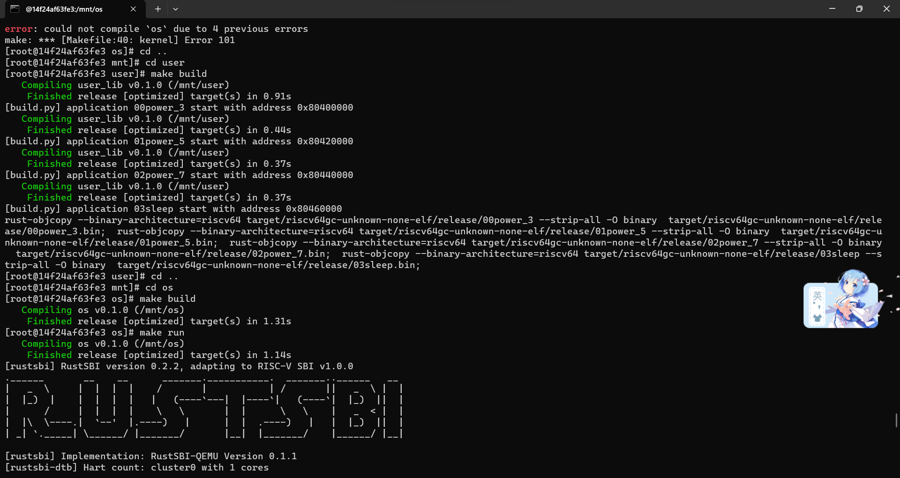
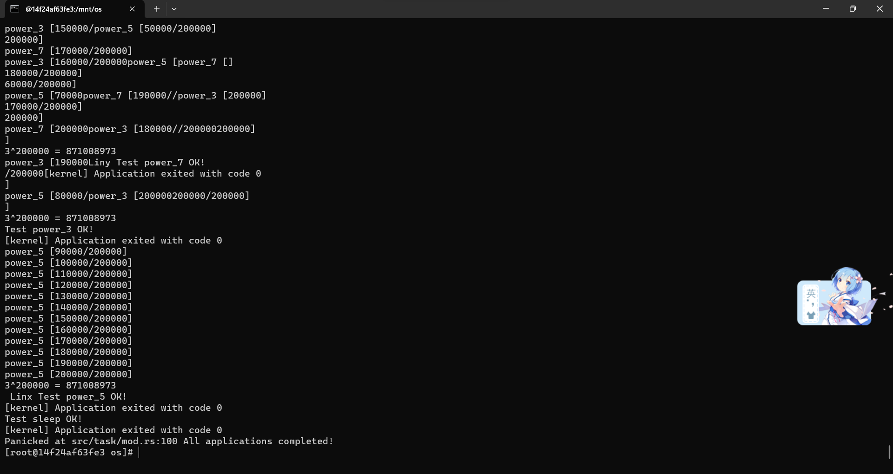

# 2023秋《操作系统》课程实验报告 实验5
> 20231214  林家旺

## 一、实验步骤 
本实验的主要目的是实现一个分时多任务和抢占式调度的操作系统。

### 1. 时钟中断与计时器

在RISC-V 64架构中，有两个状态寄存器mtime和mtimecmp。其中mtime统计加电以来内置时钟的时钟周期，mtimecmp的是在mtime超过mtimecmp时，触发一次时钟中断。

首先，实现timer子模块获取mtime的值。

在``os /src/timer.rs``中实现:

```rust
//os /src/timer.rs
use riscv::register::time;

pub fn get_time() -> usize {
    time::read()
}
```

接着，在sbi子模块实现设置mtimecmp的值，并在timer子模块进行封装。

在``os/src/sbi.rs``中实现：

```rust
//os/src/sbi.rs
const SBI_SET_TIMER: usize = 0;

pub fn set_timer(timer: usize) {
    sbi_call(SBI_SET_TIMER, timer, 0, 0);
}
```
同时在``os/src/timer.rs``中添加：

```rust
//os/src/timer.rs
use crate::sbi::set_timer;
use crate::config::CLOCK_FREQ;

const TICKS_PER_SEC: usize = 100;

pub fn set_next_trigger() {
    set_timer(get_time() + CLOCK_FREQ / TICKS_PER_SEC);
}
```

同时，为了后续的计时操作，还需要在timer子模块封装另外一个函数，实现以毫秒为单位返回当前计数器的值。

在``//os/src/timer.rs``中添加:

```rust
//os/src/timer.rs
const MSEC_PER_SEC: usize = 1000;

pub fn get_time_ms() -> usize {
    time::read() / (CLOCK_FREQ / MSEC_PER_SEC)
}
```

因为上述两个函数用到了`config.rs`中的常量

需要修改`os/src/config.rs`，增加如下内容：

```rust
pub const CLOCK_FREQ: usize = 12500000;
```

最后，还需要修改`os/src/syscall`子模块，增加get_time系统调用的实现。

在`os/src/syscall/process.rs`增加如下代码：

```rust
use crate::timer::get_time_ms;

pub fn sys_get_time() -> isize {
    get_time_ms() as isize
}
```

同时，注意修改`os/src/syscall/mod.rs`增加get_time系统调用的处理。

具体增加如下代码：

```rust
const SYSCALL_GET_TIME: usize = 169;
SYSCALL_GET_TIME => sys_get_time(),
```

### 2. 修改应用程序

#### （1）增加get_time系统调用

首先，在`user/src/syscall.rs`增加get_time系统调用，具体增加如下代码：

```rust
//user/src/syscall.rs
const SYSCALL_GET_TIME: usize = 169;

pub fn sys_get_time() -> isize {
    syscall(SYSCALL_GET_TIME, [0, 0, 0])
}
```

然后，在`user/src/lib.rs`增加get_time用户库的封装，增加代码如下：

```rust
//user/src/lib.rs
pub fn get_time() -> isize { sys_get_time() }
```

#### （2）实现新的测试应用

分别实`现00power_3.rs`，`01power_5.rs`，`02power_7.rs`以及`03sleep.rs`四个测试应用程序。

其中，`00power_3.rs`代码如下：

```rust
#![no_std]
#![no_main]

#[macro_use]
extern crate user_lib;

const LEN: usize = 100;

#[no_mangle]
fn main() -> i32 {
    let p = 3u64;
    let m = 998244353u64;
    let iter: usize = 200000;
    let mut s = [0u64; LEN];
    let mut cur = 0usize;
    s[cur] = 1;
    for i in 1..=iter {
        let next = if cur + 1 == LEN { 0 } else { cur + 1 };
        s[next] = s[cur] * p % m;
        cur = next;
        if i % 10000 == 0 {
            println!("power_3 [{}/{}]", i, iter);
        }
    }
    println!("{}^{} = {}", p, iter, s[cur]);
    println!("Test power_3 OK!");
    0
}
```

01power_5.rs，02power_7.rs两个测试应用可以通过简单修改上述代码获得。

`03sleep.rs`代码如下：

```rust
#![no_std]
#![no_main]

#[macro_use]
extern crate user_lib;

use user_lib::{get_time, yield_};

#[no_mangle]
fn main() -> i32 {
    let current_timer = get_time();
    let wait_for = current_timer + 3000;
    while get_time() < wait_for {
        yield_();
    }
    println!("Test sleep OK!");
    0
}
```

### 3. 抢占式调度
	
完成时钟中断和计时器后，就很容易实现抢占式调度了。

具体修改`os/src/trap/mod.rs`代码，具体如下：

```rust
//os/src/trap/mod.rs

use riscv::register::{
    mtvec::TrapMode,
    stvec,
    scause::{
        self,
        Trap,
        Exception,
        Interrupt,
    },
    stval,
    sie,
};

use crate::task::{
    exit_current_and_run_next,
    suspend_current_and_run_next,
};

use crate::timer::set_next_trigger;


pub fn enable_timer_interrupt() {
    unsafe { sie::set_stimer(); }
}

#[no_mangle]
pub fn trap_handler(cx: &mut TrapContext) -> &mut TrapContext {
    let scause = scause::read();
    let stval = stval::read();
    match scause.cause() {
        Trap::Exception(Exception::UserEnvCall) => {
            cx.sepc += 4;
            cx.x[10] = syscall(cx.x[17], [cx.x[10], cx.x[11], cx.x[12]]) as usize;
        }
        Trap::Exception(Exception::StoreFault) |
        Trap::Exception(Exception::StorePageFault) => {
            println!("[kernel] PageFault in application, bad addr = {:#x}, bad instruction = {:#x}, core dumped.", stval, cx.sepc);
            exit_current_and_run_next();
        }
        Trap::Exception(Exception::IllegalInstruction) => {
            println!("[kernel] IllegalInstruction in application, core dumped.");
            exit_current_and_run_next();
        }
        Trap::Interrupt(Interrupt::SupervisorTimer) => {
            set_next_trigger();
            suspend_current_and_run_next();
        }
        _ => {
            panic!("Unsupported trap {:?}, stval = {:#x}!", scause.cause(), stval);
        }
    }
    cx
}
```

这里通过调用suspend_current_and_run_next实现应用的切换。注意这里部分代码是修改，并不是直接新增。

另外，我们还需要在第一个应用执行之前在main.rs中做一些初始化的工作。

具体增加如下代码：

```rust
mod timer;

trap::enable_timer_interrupt();
timer::set_next_trigger();
```




至此，支持分时多任务和抢占式调度的操作系统实现完成。

## 二、思考问题

### 4. 思考和回答问题

#### （1）分析分时多任务是如何实现的

分时多任务以`时间片`为单位，让每个任务按照规定的`时间片`在系统中占用`CPU`执行一段时间。

#### （2）分析抢占式调度是如何设计和实现的

抢占式调度则是通过系统首先来设置一个`timer`（中断触发器），在每次中断处理中重新设置新的中断处理器，保证任务能够进行切换。

#### （3）对比上个实验实现的协作式调度与本实验实现的抢占式调度

协作式调度依赖于应用程序依据与时间片自主让出 CPU 所有权，而抢占式调度中操作系统则通过系统设置的中断触发器能够强制性地收回 CPU 的使用权并交给其他的任务。

## 三、Git提交截图

[说明文字：提交时请删除该说明。请截取github或者gitee中当次实验全部提交记录的截图。为了区别开不同的实验，建议每个实验创建一个git分支。]
四、其他说明
[说明文字：提交时请删除该说明。自己想补充的其他说明。]