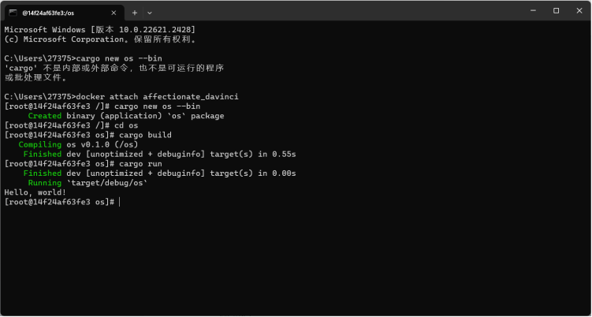
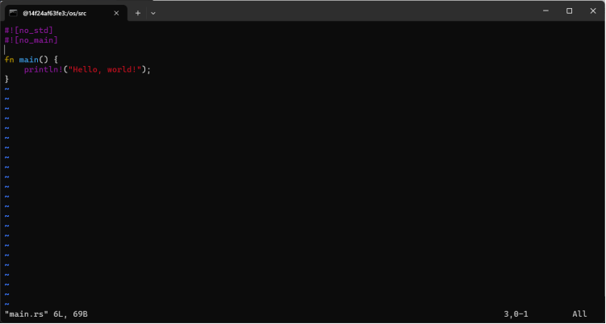
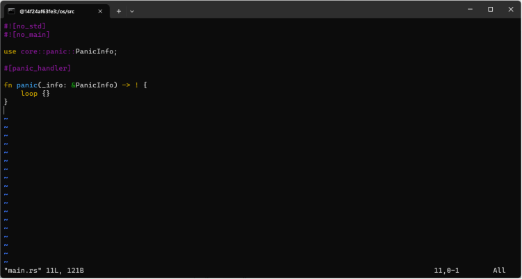
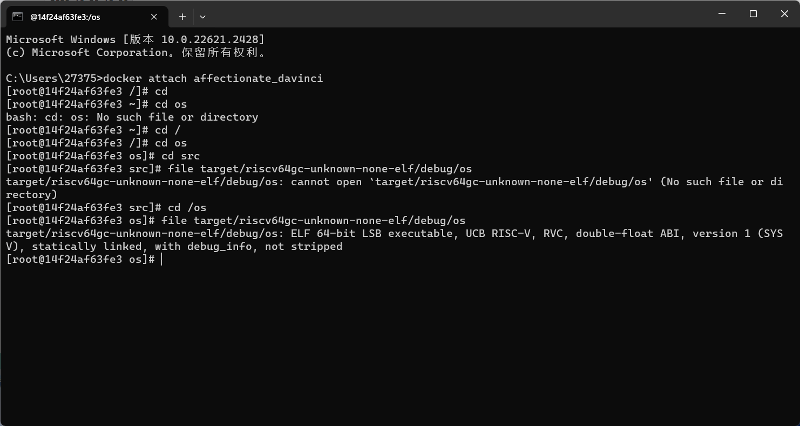
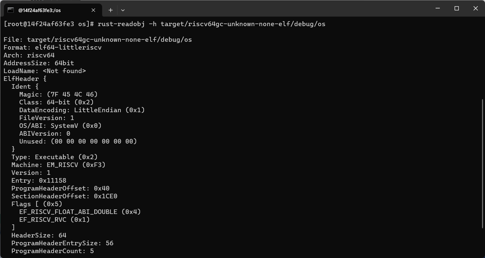
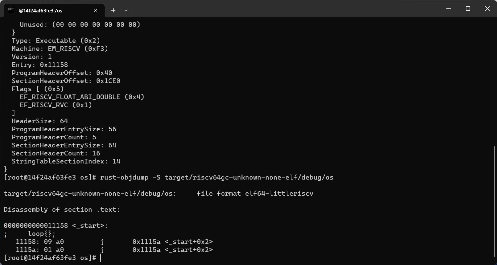
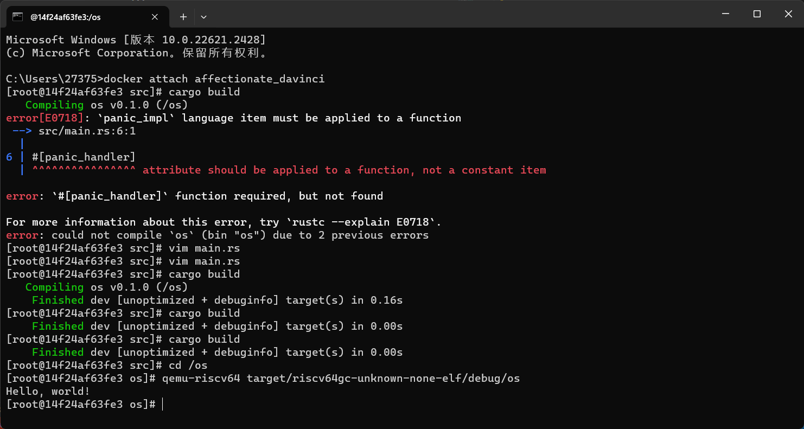

# 2023秋《操作系统》课程实验报告
    实验1    21301156  林家旺

--- 
本次实验存在一个前提，你需要用配置环境中的my_openeuler的镜像创建一个容器，本次实验需要启动这一个容器


## 一、实验步骤 
[说明文字：提交时请删除该说明。实验步骤应包含每一个步骤简短及结果截图。]
### 1. 创建一个Rust项目

首先进入已配置的好环境的容器，并进入/mnt目录。
执行如下命令查看应用运行结果。

### 2. 移除标准库依赖

#### （1） 首先，需要修改target为riscv64
在os/.cargo目录下创建config文件，并增加如下内容：
```rust
# os/.cargo/config
[build]
target = "riscv64gc-unknown-none-elf"
```
---
#### （2）修改main.rs文件
 在 main.rs 的开头分别加入如下内容：

main.rs 的位置，可以先进行回到os目录
```
cd /os
```
然后使用语句
```ls```
会出现src目录，这就是main.rs的位置

此处命令行语句可以使用:
```
cd src
vim main.rs
```
就可以往里面写东西了

```rust
#![no_std]
#![no_main]
```


同时，因为标准库 std 中提供了 panic 的处理函数 #[panic_handler]，所以还需要实现panic handler。
具体增加如下内容：
```rust
use core::panic::PanicInfo;

#[panic_handler]
fn panic(_info: &PanicInfo) -> ! {
    loop {}
}
```
注意还需要删除main函数。



---
修改完后执行cargo build进行编译。如若出现编译错误，请尝试执行如下命令安装相关软件包。
```
rustup target add riscv64gc-unknown-none-elf
cargo install cargo-binutils
rustup component add llvm-tools-preview
rustup component add rust-src
```

---
修改完成的可以编译通过的代码如下：
```rust
#![no_std]
#![no_main]

use core::panic::PanicInfo;

#[panic_handler]
fn panic(_info: &PanicInfo) -> ! {
    loop {}
}
```

修改完成代码后，请提交git，并注意在commit的注释中加入自己的学号。（记得加学号！！！）
同时，建议在自己本机提交，而不是在docker镜像中提交。

#### （3）分析独立的可执行程序
执行如下命令分析移除标准库后的独立可执行程序。
*** 此处需要回退到os文件夹
```
cd /os
```
```rust
file target/riscv64gc-unknown-none-elf/debug/os
rust-readobj -h target/riscv64gc-unknown-none-elf/debug/os
rust-objdump -S target/riscv64gc-unknown-none-elf/debug/os
```


通过分析可以发现编译生成的二进制程序是一个空程序，这是因为编译器找不到入口函数，所以没有生成后续的代码。
请注意通过截图记录分析的结果，并将结果放进实验报告，截图请截取整个命令行窗口。





### 3. 用户态可执行的环境

#### （1）增加入口函数
我们还需要增加入口函数，rust编译器要找的入口函数是 _start() 。
因此，我们可以在main.rs中增加如下内容：
```rust
#[no_mangle]
extern "C" fn _start() {
    loop{};
}
```

然后重新编译(在src 文件夹)
```
cargo build
```

接着，通过如下命令：

```
qemu-riscv64 target/riscv64gc-unknown-none-elf/debug/os
```

执行编译生成的程序，可以发现是在执行一个死循环，也即无任何输出，程序也不结束。

如果把loop注释掉，然后重新编译执行的话，会发现出现了Segmentation fault。这是因为目前程序还缺少一个正确的退出机制。

接着，我们实现程序的退出机制。

#### （2）实现退出机制
实现应用程序退出，在main.rs中增加如下代码：
```rust
use core::arch::asm;

const SYSCALL_EXIT: usize = 93;

fn syscall(id: usize, args: [usize; 3]) -> isize {
    let mut ret: isize;
    unsafe {
        asm!("ecall",
             in("x10") args[0],
             in("x11") args[1],
             in("x12") args[2],
             in("x17") id,
             lateout("x10") ret
        );
    }
    ret
}

pub fn sys_exit(xstate: i32) -> isize {
    syscall(SYSCALL_EXIT, [xstate as usize, 0, 0])
}

#[no_mangle]
extern "C" fn _start() {
    sys_exit(9);
}
```

修改完后，再重新编译和执行就可以发现程序能够正常退出了。

#### （3）实现输出支持
首先，封装一下对SYSCALL_WRITE系统调用。这个是Linux操作系统内核提供的系统调用，其ID就是SYSCALL_WRITE。

```rust
const SYSCALL_WRITE: usize = 64;

pub fn sys_write(fd: usize, buffer: &[u8]) -> isize {
  syscall(SYSCALL_WRITE, [fd, buffer.as_ptr() as usize, buffer.len()])
}
```

然后，实现基于 Write Trait 的数据结构，并完成 Write Trait 所需要的 write_str 函数，并用 print 函数进行包装。

```rust
struct Stdout;

impl Write for Stdout {
    fn write_str(&mut self, s: &str) -> fmt::Result {
        sys_write(1, s.as_bytes());
        Ok(())
    }
}

pub fn print(args: fmt::Arguments) {
    Stdout.write_fmt(args).unwrap();
}
```


最后，实现基于 print 函数，实现Rust语言 格式化宏 ( formatting macros )。
```rust
use core::fmt::{self, Write};

#[macro_export]
macro_rules! print {
    ($fmt: literal $(, $($arg: tt)+)?) => {
        $crate::console::print(format_args!($fmt $(, $($arg)+)?));
    }
}

#[macro_export]
macro_rules! println {
    ($fmt: literal $(, $($arg: tt)+)?) => {
        print(format_args!(concat!($fmt, "\n") $(, $($arg)+)?));
    }
}
```


同时在入口函数_start增加println输出。

println!("Hello, world!");

既把_start()函数修改为
```rust
#[no_mangle]
extern "C" fn _start() {
    println!("Hello, world!");

    sys_exit(9);
}
```
编译( cargo build )并通过如下命令执行，就可以看到独立的可执行程序已经支持输出显示了。
```
qemu-riscv64 target/riscv64gc-unknown-none-elf/debug/os
```




二、思考问题
[说明文字：提交时请删除该说明。请仔细回答每个实验中的思考问题。]
（1）思考问题1
这是思考问题的答案。
（2）思考问题2
这是思考问题的答案。
三、Git提交截图
[说明文字：提交时请删除该说明。请截取github或者gitee中当次实验全部提交记录的截图。为了区别开不同的实验，建议每个实验创建一个git分支。]
四、其他说明
[说明文字：提交时请删除该说明。自己想补充的其他说明。]
